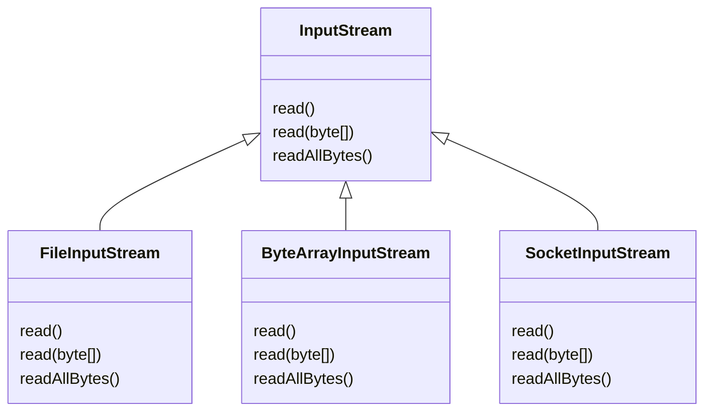
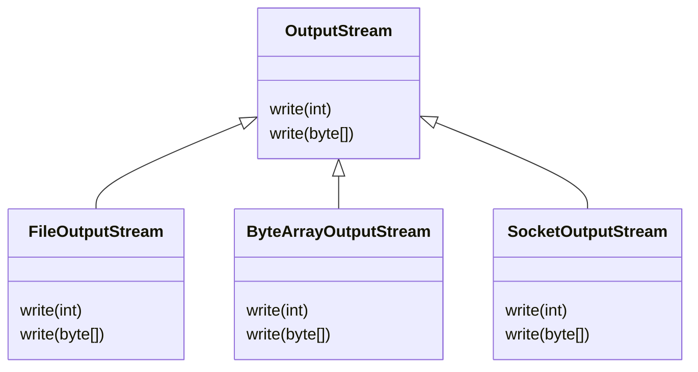

# 문자 인코딩
## 컴퓨터와 문자 인코딩
문자 'A', 'B'를 2진수로 변경하는 수학 공식 같은 것은 세상에 없다.
이런 문제를 해결하기 위해 초창기 컴퓨터 과학자들은 문자 집합을 만들고, 각 문자에 숫자를 연결시키는 방법을 생각해 냈다.
예를 들어 우리가 문자 'A'를 저장하면, 컴퓨터는 문자 집합을 통해 'A'의 숫자 값을 65를 찾는다.
그리고 65를 메모리에 저장한다. 메모리에 저장된 문자를 불러 올 때는 반대로 작동한다. 메모리에 저장된 숫자 값 65를 불러온다.
그리고 문자 집합을 통해 문자 'A'를 찾아서 화면에 출력한다.

* 문자 인코딩: 문자 집합을 통해 문자를 숫자로 변환하는 것
* 문자 디코딩: 문자 집합을 통해 숫자를 문자로 변환하는 것

### ASCII 문자 집합
각 컴퓨터 회사가 독자적인 문자 집합을 사용한다면, 서로 다른 컴퓨터 간에 문자가 올바르게 표시되지 않는 문제가 발생할 수 있다.
이러한 호환성 문제를 해결하기 위해 ASCII(American Standard Code for Information Interchange)라는 표준 문자 집합이 1960년도에 개발되었다.
초기 컴퓨터에서는 주로 영문 알파벳, 숫자, 키보드의 특수문자, 스페이스, 엔터와 같은 기본적인 문자만 표현하면 충분했다.
따라서 7비트를 사용하여 총 128가지 문자를 표현할 수 있는 ASCII 공식 문자 집합이 만들어 졌다.

###  ISO_8859_1
서유럽을 중심으로 컴퓨터 사용 인구가 늘어나면서, 서유럽 문자를 표현하는 문자 집합이 필요해졌다.

ISO_8859_1
* 1980년도
* 기존 ASCII에 서유럽 문자의 추가 필요
* 국제 표준화 기구에서 서유럽 문자를 추가한 새로운 문자 규격을 만듬
* `ISO_8859_1`, `LATIN1`, `ISO-LATIN-1` 등으로 불림
  * 8bit(1byte) 문자 집합 -> 총 256가지 표현 가능
  * 기존 7비트 ASCII(0-127)를 그대로 유지
  * ASCII에 128가지 문자를 추가함
* 기존 ASCII 문자 집합과 호환 가능

### 한글 문자 집합
한국에서도 컴퓨터 사용 인구가 늘어나면서, 한글을 표현할 수 있는 문자 집합이 필요 해졌다.

EUC-KR
* 1980년도
* 초창기 등장한 한글 문자 집합(더 이전에 KS5601이 있었음)
* 모든 한글을 담는 것 보다는 자주 사용하는 한글 2350개만 포함해서 만들었다.
* 한글의 글자는 아주 많기 때문에 256가지만 표현할 수 있는 1byte로 표현하는 것은 불가능하다.
* 2byte(16bit)를 사용하면 65536가지 표현 가능
* ASCII + 자주 사용하는 한글 2350개 + 한국에서 자주 사용하는 기타 글자
  * 한국에서 자주 사용하는 한자 4,888개
  * 일본 가타카나등도 함께 포함
* ASCII는 1byte, 한글은 2byte를 사용한다.
  * 영어를 사용하면 1byte를 한글을 사용하면 2byte를 메모리에 저장한다.
* 기존 ASCII 문자 집합과 호환 가능

MS949
* 1990년도
* 마이크로소프트가 EUC-KR을 확장하여 만든 인코딩
* 한글 초성, 중성, 종성 모두 조합하면 가능한 한글의 수는 총 11,1172자
* EUC-KR은 드물게 사용하는 음절을 표현하지 못함
* 기존 EUC-KR과 호환을 이루면서 한굴 11,172자를 모두 수용하도록 만든 것이 MS949
* EUC-KR과 마찬가지로 ASCII는 1byte, 한글은 2byte를 사용함
* 기존 ASCII 문자 집합과 호환 가능
* 윈도우 시스템에서 계속 사용됨

### 전세계 문자 집합
전세계적으로 컴퓨터 인구가 늘어나면서, 전세계 문자를 대부분 다 표현할 수 있는 문자 집합이 필요해졌다.

문제
* EUC-KR이나 MS949 같은 한글 문자표를 PC에 설치하지 않으면 다른 나라 사람들은 한글로 작성된 문서를 열어볼 수 없다.
* 1980년대 말, 다양한 문자 인코딩 표준이 존재했지만, 이들은 모두 특정 언어 또는 문자 세트를 대상으로 했기 때문에 국제적으로 호환성 문제가 많았다.

유니코드의 등장
* 이를 해결하기 위해 전 세계의 모든 문자들을 단일 문자 세트로 표현할 수 있는 유니코드(Unicode) 표준이 1990년대에 도입되었다.
* 전 세계의 모든 문자와 기호를 하나의 표준으로 통합하여 표현할 수 있는 문자 집합을 만드는 것
* UTF-16, UTF-8의 시작
* 두 표준이 비슷하게 등장, 초반에는 UTF-16이 인기

UTF-16
* 1990년도
* 16bit(2byte)기반
* 자주 사용하는 기본 다국어들은 2byte로 표현, 2byte는 65536가지를 표현할 수 있다.
  * 영어, 유럽 언어, 한국어, 중국어, 일본어등이 2byte를 사용한다.
* 그 외 4byte로 표현 4byte는 42억가지를 표현할 수 있다.
  * 고대 문자, 이모지, 중국어 확장 한자 등
* 단점: ASCII 영문도 2byte를 사용한다. ASCII와 호환되지 않음
  * UTF-16을 사용한다면 영문의 경우 다른 문자 집합 보다 2배의 메모리를 더 사용한다.
  * 웹에 있는 문서의 80% 이상은 영문 문서이다.
  * ASCII와 호환되지 않는다는 점도 큰 단점 중 하나이다.
* 초반에는 UTF-16이 인기, 이 시기에 등장한 자바 언어도 내부적으로 문자를 표현할 때 UTF-16을 사용함, 그래서 자바의 `char`타입이 2byte를 사용함
* 대부분 문자를 2byte로 처리하기 때문에 계산이 편리함

UTF-8
* 1990년도
* 8bit(1byte)기반, 가변길이 인코딩
* 1byte ~ 4byte를 사용해서 문자를 인코딩
  * 1byte: ASCII, 영문, 기본 라틴 문자
  * 2byte: 그리스어, 히브리어, 라틴 확장 문자
  * 3byte: 한글, 한자, 일본어
  * 4byte: 이모지, 고대문자 등
* 단점: 
  * 상대적으로 사용이 복잡함
    * UTF-16은 대부분의 기본 문자들이 2byte로 표현되기 때문에, 문자열의 특정 문자에 접근하거나 문자 수를 세는 작업이 상대적으로 간담함. 반면, UTF-8에서는 각 문자가 가변 길이로 인코딩되므로 이런 작업이 더 복잡함
  * ASCII를 제외한 일부 언어에서 더 많은 용량 사용
    * UTF-8은 ASCII를 1byte로 비 ASCII 문자를 2~4byte로 인코딩 한다.
    * 한글, 한자, 아랍어, 히브리어와 같은 문자들은 UTF-8에서 3~4byte를 차지한다.
* 장점:
  * ASCII 문자는 1byte로 표현 == ASCII 문자 호환
  * 현대의 사실상 표준 인코딩 기술

---
# I/O 기본1
## 스트림
현대의 컴퓨터는 대부분 byte 단위로 데이터를 주고 받는다.
참고로 bit 단위는 너무 작기 때문에 byte 단위를 기본으로 사용한다.
이렇게 데이터를 주고 받는 것을 Input/Output(I/O)라 한다.
자바는 내부에 있는 데이터를 외부에 있는 파일에 저장하거나, 네트워크를 통해 전송하거나, 콘솔에 출력때 모두 byte 단위로 데이터를 주고 받는다.
만약 파일, 네트워크, 콘솔 각각 데이터를 주고 받는 방식이 다르다면 상당히 불편할 것이다.
또한 파일에 저장하던 내용을 네트워크에 전달하거나 콘솔에 출력하도록 변경할 때 너무 많은 코드를 변경해야 할 수 있다.
이런 문제를 해결하기 위해 자바는 `InputStream`, `OutputStream`이라는 기본 추상 클래스를 제공한다.

>정리

`InputStream`과 `OutputStream`이 다양한 스트림들을 추상화하고 기본 기능에 대한 표준을 잡아둔 덕분에 
개발자는 편리하게 입출력 작업을 수행할 수 있다. 이러한 추상화의 장점은 다음과 같다.
* 일관성: 모든 종류의 입출력 작업에 대해 동일한 인터페이스(여기에서는 부모의 메서드)를 사용할 수 있어, 코드의 일관성이 유지된다.
* 유연성: 실제 데이터 소스나 목적지가 무엇인지 관계없이 동일한 방식으로 코드를 작성할 수 있다. 예를 들어, 파일, 네트워크, 메모리 등 다양한 소스에 대해 동일한 메서드를 사용할 수 있다.
* 확장성: 새로운 유형의 입출력 스트림을 쉽게 추가할 수 있다.
* 재사용성: 다양한 스트림 클래스들을 조합하여 복잡한 입출력 작업을 수행할 수 있다. 예를 들어 `BufferdInputStream`을 사용하여 성능을 향상시키거나, `DataInputStream`을 사용하여 기본 데이터 타입을 쉽게 읽을 수있다.
* 에러 처리: 표준화된 예외 처리 메커니즘을 통해 일관된 방식으로 오류를 처리할 수 있다.
