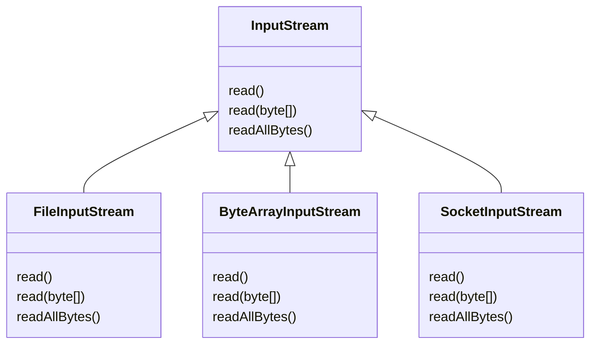
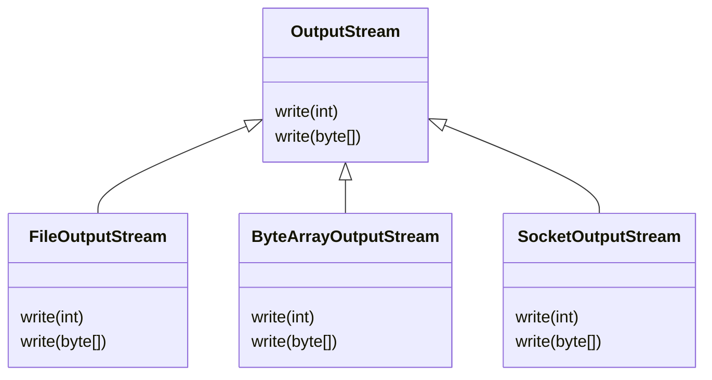
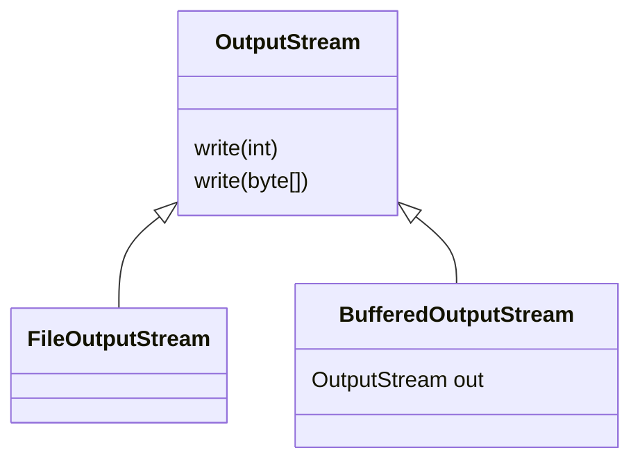
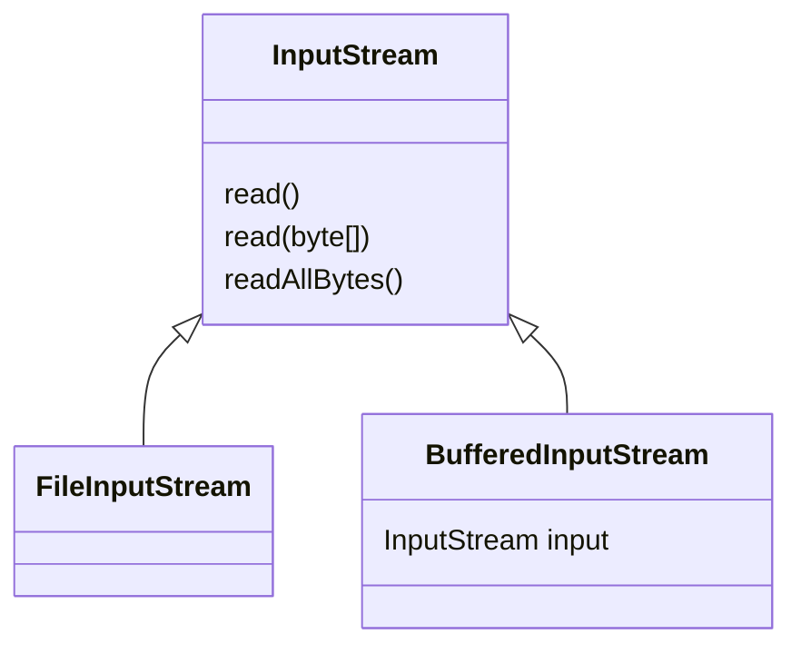
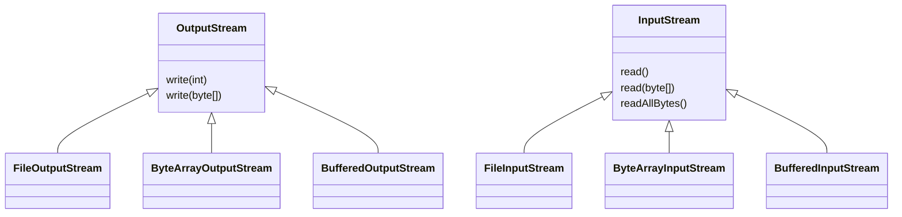
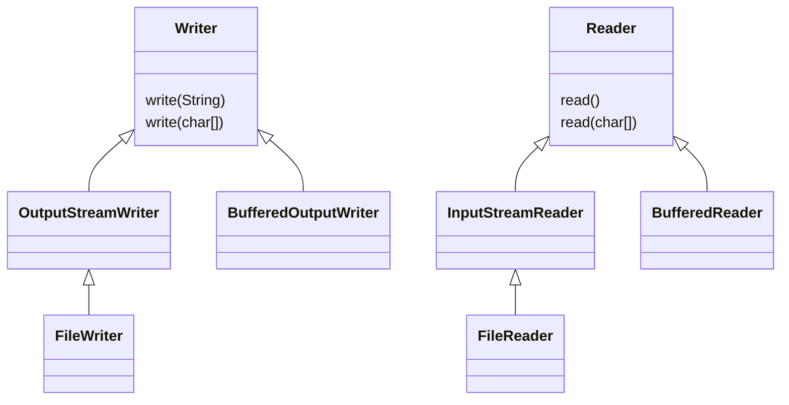

# 문자 인코딩
## 컴퓨터와 문자 인코딩
문자 'A', 'B'를 2진수로 변경하는 수학 공식 같은 것은 세상에 없다.
이런 문제를 해결하기 위해 초창기 컴퓨터 과학자들은 문자 집합을 만들고, 각 문자에 숫자를 연결시키는 방법을 생각해 냈다.
예를 들어 우리가 문자 'A'를 저장하면, 컴퓨터는 문자 집합을 통해 'A'의 숫자 값을 65를 찾는다.
그리고 65를 메모리에 저장한다. 메모리에 저장된 문자를 불러 올 때는 반대로 작동한다. 메모리에 저장된 숫자 값 65를 불러온다.
그리고 문자 집합을 통해 문자 'A'를 찾아서 화면에 출력한다.

* 문자 인코딩: 문자 집합을 통해 문자를 숫자로 변환하는 것
* 문자 디코딩: 문자 집합을 통해 숫자를 문자로 변환하는 것

### ASCII 문자 집합
각 컴퓨터 회사가 독자적인 문자 집합을 사용한다면, 서로 다른 컴퓨터 간에 문자가 올바르게 표시되지 않는 문제가 발생할 수 있다.
이러한 호환성 문제를 해결하기 위해 ASCII(American Standard Code for Information Interchange)라는 표준 문자 집합이 1960년도에 개발되었다.
초기 컴퓨터에서는 주로 영문 알파벳, 숫자, 키보드의 특수문자, 스페이스, 엔터와 같은 기본적인 문자만 표현하면 충분했다.
따라서 7비트를 사용하여 총 128가지 문자를 표현할 수 있는 ASCII 공식 문자 집합이 만들어 졌다.

###  ISO_8859_1
서유럽을 중심으로 컴퓨터 사용 인구가 늘어나면서, 서유럽 문자를 표현하는 문자 집합이 필요해졌다.

ISO_8859_1
* 1980년도
* 기존 ASCII에 서유럽 문자의 추가 필요
* 국제 표준화 기구에서 서유럽 문자를 추가한 새로운 문자 규격을 만듬
* `ISO_8859_1`, `LATIN1`, `ISO-LATIN-1` 등으로 불림
  * 8bit(1byte) 문자 집합 -> 총 256가지 표현 가능
  * 기존 7비트 ASCII(0-127)를 그대로 유지
  * ASCII에 128가지 문자를 추가함
* 기존 ASCII 문자 집합과 호환 가능

### 한글 문자 집합
한국에서도 컴퓨터 사용 인구가 늘어나면서, 한글을 표현할 수 있는 문자 집합이 필요 해졌다.

EUC-KR
* 1980년도
* 초창기 등장한 한글 문자 집합(더 이전에 KS5601이 있었음)
* 모든 한글을 담는 것 보다는 자주 사용하는 한글 2350개만 포함해서 만들었다.
* 한글의 글자는 아주 많기 때문에 256가지만 표현할 수 있는 1byte로 표현하는 것은 불가능하다.
* 2byte(16bit)를 사용하면 65536가지 표현 가능
* ASCII + 자주 사용하는 한글 2350개 + 한국에서 자주 사용하는 기타 글자
  * 한국에서 자주 사용하는 한자 4,888개
  * 일본 가타카나등도 함께 포함
* ASCII는 1byte, 한글은 2byte를 사용한다.
  * 영어를 사용하면 1byte를 한글을 사용하면 2byte를 메모리에 저장한다.
* 기존 ASCII 문자 집합과 호환 가능

MS949
* 1990년도
* 마이크로소프트가 EUC-KR을 확장하여 만든 인코딩
* 한글 초성, 중성, 종성 모두 조합하면 가능한 한글의 수는 총 11,1172자
* EUC-KR은 드물게 사용하는 음절을 표현하지 못함
* 기존 EUC-KR과 호환을 이루면서 한굴 11,172자를 모두 수용하도록 만든 것이 MS949
* EUC-KR과 마찬가지로 ASCII는 1byte, 한글은 2byte를 사용함
* 기존 ASCII 문자 집합과 호환 가능
* 윈도우 시스템에서 계속 사용됨

### 전세계 문자 집합
전세계적으로 컴퓨터 인구가 늘어나면서, 전세계 문자를 대부분 다 표현할 수 있는 문자 집합이 필요해졌다.

문제
* EUC-KR이나 MS949 같은 한글 문자표를 PC에 설치하지 않으면 다른 나라 사람들은 한글로 작성된 문서를 열어볼 수 없다.
* 1980년대 말, 다양한 문자 인코딩 표준이 존재했지만, 이들은 모두 특정 언어 또는 문자 세트를 대상으로 했기 때문에 국제적으로 호환성 문제가 많았다.

유니코드의 등장
* 이를 해결하기 위해 전 세계의 모든 문자들을 단일 문자 세트로 표현할 수 있는 유니코드(Unicode) 표준이 1990년대에 도입되었다.
* 전 세계의 모든 문자와 기호를 하나의 표준으로 통합하여 표현할 수 있는 문자 집합을 만드는 것
* UTF-16, UTF-8의 시작
* 두 표준이 비슷하게 등장, 초반에는 UTF-16이 인기

UTF-16
* 1990년도
* 16bit(2byte)기반
* 자주 사용하는 기본 다국어들은 2byte로 표현, 2byte는 65536가지를 표현할 수 있다.
  * 영어, 유럽 언어, 한국어, 중국어, 일본어등이 2byte를 사용한다.
* 그 외 4byte로 표현 4byte는 42억가지를 표현할 수 있다.
  * 고대 문자, 이모지, 중국어 확장 한자 등
* 단점: ASCII 영문도 2byte를 사용한다. ASCII와 호환되지 않음
  * UTF-16을 사용한다면 영문의 경우 다른 문자 집합 보다 2배의 메모리를 더 사용한다.
  * 웹에 있는 문서의 80% 이상은 영문 문서이다.
  * ASCII와 호환되지 않는다는 점도 큰 단점 중 하나이다.
* 초반에는 UTF-16이 인기, 이 시기에 등장한 자바 언어도 내부적으로 문자를 표현할 때 UTF-16을 사용함, 그래서 자바의 `char`타입이 2byte를 사용함
* 대부분 문자를 2byte로 처리하기 때문에 계산이 편리함

UTF-8
* 1990년도
* 8bit(1byte)기반, 가변길이 인코딩
* 1byte ~ 4byte를 사용해서 문자를 인코딩
  * 1byte: ASCII, 영문, 기본 라틴 문자
  * 2byte: 그리스어, 히브리어, 라틴 확장 문자
  * 3byte: 한글, 한자, 일본어
  * 4byte: 이모지, 고대문자 등
* 단점: 
  * 상대적으로 사용이 복잡함
    * UTF-16은 대부분의 기본 문자들이 2byte로 표현되기 때문에, 문자열의 특정 문자에 접근하거나 문자 수를 세는 작업이 상대적으로 간담함. 반면, UTF-8에서는 각 문자가 가변 길이로 인코딩되므로 이런 작업이 더 복잡함
  * ASCII를 제외한 일부 언어에서 더 많은 용량 사용
    * UTF-8은 ASCII를 1byte로 비 ASCII 문자를 2~4byte로 인코딩 한다.
    * 한글, 한자, 아랍어, 히브리어와 같은 문자들은 UTF-8에서 3~4byte를 차지한다.
* 장점:
  * ASCII 문자는 1byte로 표현 == ASCII 문자 호환
  * 현대의 사실상 표준 인코딩 기술

---
# I/O 기본1
## 스트림
현대의 컴퓨터는 대부분 byte 단위로 데이터를 주고 받는다.
참고로 bit 단위는 너무 작기 때문에 byte 단위를 기본으로 사용한다.
이렇게 데이터를 주고 받는 것을 Input/Output(I/O)라 한다.
자바는 내부에 있는 데이터를 외부에 있는 파일에 저장하거나, 네트워크를 통해 전송하거나, 콘솔에 출력때 모두 byte 단위로 데이터를 주고 받는다.
만약 파일, 네트워크, 콘솔 각각 데이터를 주고 받는 방식이 다르다면 상당히 불편할 것이다.
또한 파일에 저장하던 내용을 네트워크에 전달하거나 콘솔에 출력하도록 변경할 때 너무 많은 코드를 변경해야 할 수 있다.
이런 문제를 해결하기 위해 자바는 `InputStream`, `OutputStream`이라는 기본 추상 클래스를 제공한다.




>정리

`InputStream`과 `OutputStream`이 다양한 스트림들을 추상화하고 기본 기능에 대한 표준을 잡아둔 덕분에 
개발자는 편리하게 입출력 작업을 수행할 수 있다. 이러한 추상화의 장점은 다음과 같다.
* 일관성: 모든 종류의 입출력 작업에 대해 동일한 인터페이스(여기에서는 부모의 메서드)를 사용할 수 있어, 코드의 일관성이 유지된다.
* 유연성: 실제 데이터 소스나 목적지가 무엇인지 관계없이 동일한 방식으로 코드를 작성할 수 있다. 예를 들어, 파일, 네트워크, 메모리 등 다양한 소스에 대해 동일한 메서드를 사용할 수 있다.
* 확장성: 새로운 유형의 입출력 스트림을 쉽게 추가할 수 있다.
* 재사용성: 다양한 스트림 클래스들을 조합하여 복잡한 입출력 작업을 수행할 수 있다. 예를 들어 `BufferdInputStream`을 사용하여 성능을 향상시키거나, `DataInputStream`을 사용하여 기본 데이터 타입을 쉽게 읽을 수있다.
* 에러 처리: 표준화된 예외 처리 메커니즘을 통해 일관된 방식으로 오류를 처리할 수 있다.

## 파일 입출력과 성능 최적화
자바에서 1byte씩 write()나, read()를 호출할 때마다 운영 체제로 시스템 콜이 발생하고, 이 시스템 콜이 자체가 상당한 오버헤드를 유발한다.
운영 체제와 하드웨어가 어느 정도 최적화를 제공하더라도, 자주 발생하는 시스템 콜로 인한 성능 저하는 피할 수 없다.
결국 자바에서 read(), write() 호출 횟수를 줄여서 시스템 콜 횟수도 줄여야 한다.

많은 데이터를 한 번에 전달하면 성능을 최적화 할 수 있다. 이렇게 되면 시스템 콜도 줄어들고 HDD, SDD 같은 장치들의 작동 횟수도 줄어 든다.
그런데 버퍼의 크기가 커진다고 해서 속도가 계속 줄어들지 않는다. 왜냐하면 디스크나 파일 시스템에서 데이터를 읽고 쓰는 기본 단위가 보통 4KB, 8KB이기 때문이다.
결국 버퍼에 많은 데이터를 담아서 보내도 디스크나 파일 시스템에서 해당 단위로 나누어 저장하기 때문에 효율에는 한계가 있다.
따라서 버퍼의 크기는 보통 4KB, 8KB 정도로 잡는 것이 효율적이다.

### BufferedOutputStream
`BufferedOutputStream`은 버퍼 기능을 내부에서 대신 처리해준다. 따라서 단순한 코드를 유지하면서 버퍼를 사용하는 이점도 함께 누릴 수 있다.
* `BufferedOutputStream`은 내부에서 단순히 버퍼 기능만 제공한다. 따라서 반드시 대상 `OutputStream`이 있어야 한다.
* 추가로 사용할 버퍼의 크기도 함께 전달할 수 있다.
* `byte[]`을 직접 다루지 않고 단순하게 코드를 작성할 수 있다.


* `BufferedOutputStream`은 `OutputStream`을 상속받는다 따라서 개발자 입장에서 보면 `OutputStream`과 같은 기능을 그대로 사용할 수 있다.

### 기본 스트림, 보조 스트림
* `FileOutputStream`과 같이 단독으로 사용할 수 있는 스트림을 기본 스트림이라 한다.
* `BufferedOutputStream`과 같이 단독으로 사용할 수 없고, 보조 기능을 제공하는 스트림을 보조 스트림이라 한다.

### BufferedInputStream

* `BufferedInputStream`은 `InputStream`을 상속 받는다. 따라서 개발자 입장에서 보면 `InputStream`과 같은 기능을 그대로 사용할 수 있다.

### 버퍼를 직접 다루는 것보다 BufferedXxx의 성능이 떨어지는 이유
이 이유는 바로 동기화 때문이다. 
* `BufferedOutputStream`을 포함한 `BufferedXxx` 클래스는 모두 동기화 처리가 되어 있다.
* 결과적으로 락을 걸고 푸는 코드도 호출된다는 뜻이다.

#### BufferedXxx 클래스의 특징
`BufferedXxx` 클래스는 자바 초창기에 만들어진 클래스인데, 처음부터 멀티 스레드를 고려해서 만든 클래스이다.
따라서 멀티 스레드에 안전하지만 락을 걸고 푸는 동기화 코드로 인해 성능이 약간 저하될 수 있다.
하지만 싱글 스레드 상황에서는 동기화 락이 필요하지 않기 때문에 직접 버퍼를 다룰 때와 비교해서 성능이 떨어진다.
일반적인 상황이라면 이 정도 성능은 크게 문제가 되지 않기 때문에 싱글 스레드여도 `BufferedXxx` 클래스를 사용하면 충분하다.
매우 큰 데이터를 다루어야 하고, 성능 최적화가 중요하다면 직접 버퍼를 다루는 방법을 고려하자.
아쉽게도 동기화 락이 없는 `BufferedXxx` 클래스는 없다. 꼭 필요한 상황이라면 `BufferedXxx` 클래스를 참고해
동기화 락 코드를 제거한 클래스를 직접 만들어 사용하면 된다.

#### 한 번에 쓰기
파일의 크기가 크지 않다면 간단하게 한 번에 쓰고 읽는 것도 좋은 방법이다.
이 방법은 성능은 가장 빠르지만, 결과적으로 메모리를 한 번에 많이 사용하기 때문에 파일의 크기가 작아야 한다.

> 정리

* 파일의 크기가 크지 않아서, 메모리 사용에 큰 영향을 주지 않는다면 쉽고 빠르게 한 번에 처리하자.
* 성능이 중요하고 큰 파일을 나누어 처리해야 한다면, 버퍼를 직접 다루자.
* 성능이 크게 중요하지 않고, 버퍼 기능이 필요하면 `BufferedXxx` 클래스를 사용하자.
  * `BufferedXxx`는 동기화 코드가 들어 있어서 thread safe하지만 약간의 성능 저하가 있다.

---
# 문자 다루기
스트림은 `byte`만 사용할 수 있으므로, `String`과 같은 문자는 직접 전달할 수 없다.
그래서 개발자가 번거롭게 다음과 같은 변환 과정을 직접 호출해주어야 한다.
* `String` + 문자 집합 => `byte[]`
* `byte[]` + 문자 집합 => `String`

`OutputStreamWriter`, `InputStreamReader`를 사용하면 이 과정을 쉽게 처리할 수 있다.
그런데 `OutputStreamWriter`의 `write()`는 `byte`가 아니라 `String`이나 `char`를 사용한다.
어떻게 된 것일까?

자바는 byte를 다루는 I/O 클래스와 문자를 다루는 I/O 클래스를 둘로 나누어 두었다.

* byte를 다루는 클래스


* 문자를 다루는 클래스

여기서 꼭! 기억해야할 중요한 사실이 있다.
모든 데이터는 **byte 단위(숫자)로 저장된다.** 따라서 `Writer`가 아무리 문자룰 다룬다고 해도 문자를 바로 저장할 수는 없다.
이 클래스에 문자를 전달하면 결과적으로 내부에서는 지정된 문자 집합을 사용해서 문자를 byte로 인코딩해서 저장한다.

> 정리
* 기본(기반, 메인) 스트림
  * File, 메모리, 콘솔 등에 직접 접근하는 스트림
  * 단독으로 사용할 수 있음
  * 예) `FileInputStream`, `FileOutputStream`, `FileReader`, `FileWriter`, `ByteArrayInputStream`, `ByteArrayOutputStream`
* 보조 스트림
  * 기본 스트림을 도와주는 스트림
  * 단독으로 사용할 수 없음. 반드시 대상 스트림이 있어야 함
  * 예) `BufferedInputStream`, `BufferedOutputStream`, `InputStreamReader`, `OutputStreamWriter`, `DataOutputStream`, `DataInputStream`, `PrintStream`

---
# I/O 활용

## 객체 직렬화
자바 객체 직렬화(Serialization)는 메모리에 있는 객체 인스턴스를 바이트 스트림으로 변환하여 파일에 저장하거나 네트워크를 통해 전송할 수 있도록 하는 기능이다.
이 과정에서 객체의 상태를 유지하여 나중에 역직렬화(Deserialization)를 통해 원래의 객체로 복원할 수 있다.

객체 직렬화를 사용하려면 직렬화 하려는 클래스에 반드시 `Serializable` 인터페이스를 구현해야 한다.
```java
package java.io;

public interface Serializable {}
```
* 이 인터페이스에는 아무런 기능이 없다. 단지 직렬화 가능한 클래스라는 것을 표시하기 위한 인터페이스일 뿐이다.
* 메서드 없이 단지 표시가 목적인 인터페이스를 마커 인터페이스라 한다.
* 만약 해당 인터페이스가 없는 객체를 직렬화 하려면 다음과 같은 예외가 발생한다. `java.io.NotSerializableException: io.member.Member`

객체 직렬화 덕분애 객체를 매우 편리하게 저장하고 불러올 수 있었다.
객체 직렬화를 사용하면 객체를 바이트로 변환할 수 있어, 모든 종류의 스트림에 전달할 수 있다.
이는 파일에 저장하는 것은 물론, 네트워크를 통해 객체를 전송하는 것도 가능하게 한다.
이러한 특성 때문에 초기에는 분산 시스템에서 활용되었다.
그러나 객체 직렬화는 1990년대에 등장한 기술로, 초창기에는 인기가 있었지만 시간이 지나면서 여러 단점이 드러났다.
또한 대안 기술이 등장하면서 점점 그 사용이 줄어들게 되었다.
현재는 객체 직렬화를 거의 사용하지 않는다.

## 객체 직렬화의 한계
* 버전 관리의 어려움
  * 클래스 구조가 변경되면 이전에 직렬화된 객체와의 호환성 문제가 발생한다.
  * serialVersionUID 관리가 복잡하다.
* 플랫폼 종속성
  * 자바 직렬화는 자바 플랫폼에 종속적이여서 다른 언어나 시스템과의 상호 운용성이 떨어진다.
* 성능 이슈
  * 직렬화/역직렬화 과정이 상대적으로 느리고 리소스를 많이 사용한다.
* 크기 효율성
  * 직렬화 된 데이터의 크기가 상대적으로 크다.

## 객체 직렬화의 대안
* XML
  * 플랫폼 종속성 문제를 해결하기 위해 2000년대 초반 XML이라는 기술이 인기를 끌었다.
  * XML은 유연하고 강력했지만, 복잡성과 무거움이라는 문제가 있었다.
  * 태그를 포함한 XML 문서의 크기가 커서 네트워크 전송 비용도 증가했다.
* JSON
  * 가볍고 간결하며, 자바스크립트와 자연수러운 호환성 덕분에 웹 개발자들 사이에서 빠르게 확산되었다.
  * 2000년대 후반, 웹 API와 RESTful 서비스가 대중화 되면서 JSON은 표준 데이터 교환 포맷으로 자리잡았다.
* Protofuf, Avro - 더 적응 용량, 더 빠른 성능
  * 만약 매우 작은 용량으로 더 빠른 속도가 필요하다면 Protobuf, Avro 같은 대안 기술이 있다.
  * 이런 기술은 호환성은 떨어지지만 byte 기반에, 용량과 성능 최적화가 되어있으므로 매우 빠르다.
  * 다만 byte 기반이므로 JSON처럼 사람이 직접 읽기는 어렵다.

---
# File, Files
자바 1.0에서 `File` 클래스가 등장했다. 이후에 자바 1,7에서 `Files` 클래스를 대체할 `Files`와 `Path`가 등장했다.

## Files의 특징
* 성능과 편의성이 모두 개선되었다.
* `File`은 과거의 호환성을 유지하기 위해 남겨둔 기능이다. 이제는 `Files` 사용을 먼저 고려하자.
* `File` 클래스는 물론이고, `File`과 관련된 스트림(`FileInputStream`, `FileWriter`)의 사용을 고민하기 전에 `Files`에 있는 기능을 먼저 찾아보자 성능도 좋고, 사용하기도 더 편리하다.

## 파일 복사 최적화
```java
try (FileInputStream fis = new FileInputStream("temp/copy.dat"); 
     FileOutputStream fos = new FileOutputStream("temp/copy_new.dat")) {
    fos.write(fis.readAllBytes());
}
```
* `FileInputStream`에서 `readAllbytes`를 통해 한 번에 모든 데이터를 읽고 `write(bytes)`를 통해 한 번에 모든 데이터를 저장한다.
* 파일 -> 자바 -> 파일의 과정을 거친다.
* 자바가 `copy.dat`파일의 데이터를 자바 프로세스가 사용하는 메모리에 불러온다. 그리고 메모리에 있는 데이터를 `copy_new.dat`에 전달한다.

```java
Path source = Path.of("temp/copy.dat");
Path target = Path.of("temp/copy_new.dat");
Files.copy(source, target, StandardCopyOption.REPLACE_EXISTING);
```
* `Files.copy()`는 자바에서 파일 데이터를 불러오지 않고, 운영체제의 파일 복사 기능을 사용한다.
* 파일을 다루어야 할 일이 있다면 항상 `Files`의 기능을 먼저 고려하자.
* 만약 파일의 정보를 읽어서 처리해야 하거나, 스트림을 통해 네트워크에 전달해야 한다면 스트림을 직접 사용해야 한다.